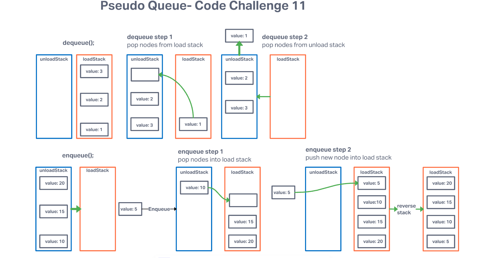

# Code Challenge 11

Create two empty stacks
Fill the unload stack with a stack (nothing)
Fill the load stack with a stack (three values)

Dequeue
Move all nodes into the unload stack
Do this while there are nodes in this stack
Take the top node off of the unload stack
Return the node.

Enqueue
Move all nodes from the unload stack into the load stack
Do this while there are nodes in this stack
Create a new node
Insert the new node on the top node off of the load stack
